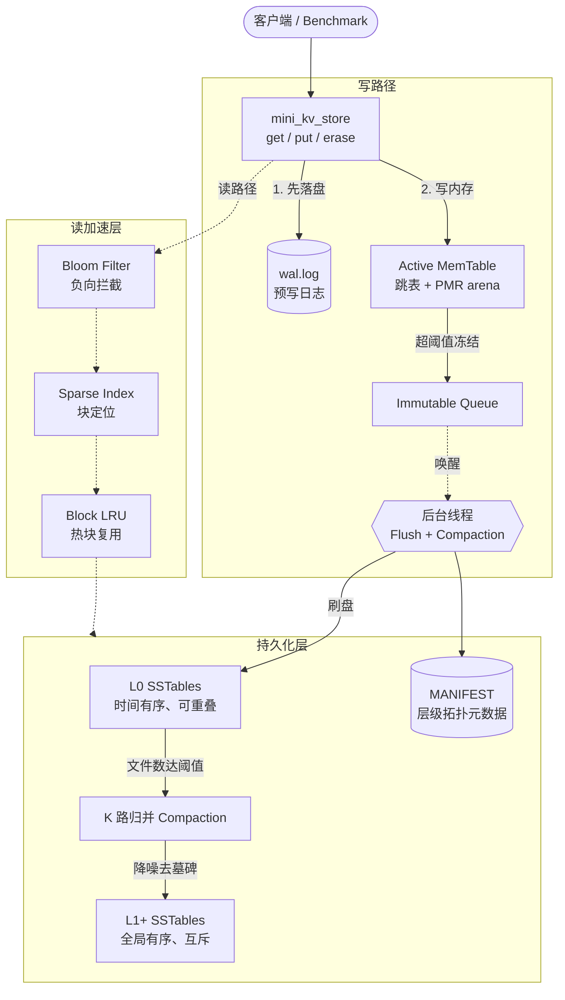
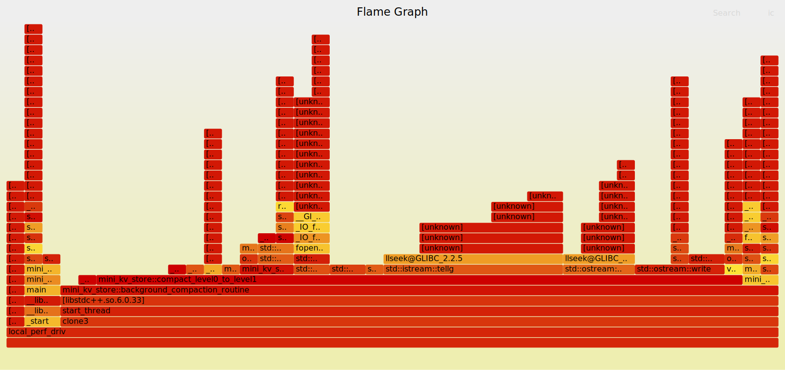

<div align="center">

**[English](README_EN.md) | 中文**

# Mini-LevelDB

**一个从零实现的 LSM-Tree 键值存储引擎**

基于 C++20 构建，覆盖 WAL、跳表内存表、SSTable、布隆过滤器、分层 Compaction 与多级缓存的完整持久化链路。

[](https://en.cppreference.com/w/cpp/20)
[](https://cmake.org/)
[](#)
[](#5-质量验证)
[](#6-快速开始)

</div>

---

## 目录

- [1. 项目定位](#1-项目定位)
- [2. 项目亮点](#2-项目亮点)
- [3. 架构设计](#3-架构设计)
- [4. 核心技术拆解](#4-核心技术拆解需求--难点--设计--效果)
- [5. 质量验证](#5-质量验证)
- [6. 快速开始](#6-快速开始)
- [7. 项目结构](#7-项目结构)
- [8. 已知边界与演进方向](#8-已知边界与演进方向)

---

## 1. 项目定位

`Mini-LevelDB` 是一个**教学级但工程化**的嵌入式键值存储引擎，目标是把 Google LevelDB / RocksDB 背后的 **LSM-Tree（Log-Structured Merge Tree）** 架构，用现代 C++ 从地基到屋顶完整重写一遍——不是调库，而是亲手实现 WAL 持久化、内存跳表、SSTable 文件格式、布隆过滤器、稀疏索引、Block LRU 缓存以及后台分层 Compaction。

它适用于以下场景：

- 想**深入理解 LSM 存储引擎内部机制**的学习者
- 需要一个**结构清晰、可独立编译**的引擎参考实现
- 关注**现代 C++（`std::pmr`、`std::span`、`std::bit_cast`、concepts）在系统编程中落地**的工程实践

> 写入走「先 WAL 后内存」保证崩溃可恢复，读取走「内存 → 不可变队列 → L0 → L1+」的分层穿透，并用布隆过滤器 + 稀疏索引 + 块缓存三级加速消灭无效磁盘 I/O。这正是工业级 KV 引擎的核心骨架。

---

## 2. 项目亮点

| 维度 | 实现要点 |
|---|---|
| **完整 LSM 链路** | WAL → MemTable → Immutable Queue → L0 SSTable → Compaction → L1+，全部自研，无第三方存储依赖 |
| **现代 C++ 内存模型** | 跳表节点基于 `std::pmr::monotonic_buffer_resource` 做 arena 分配，零碎片、批量回收 |
| **零拷贝二进制编解码** | `coding` 模块用 concepts 约束 + `std::bit_cast` / `std::span` 实现类型安全的定长序列化 |
| **三级读加速** | 布隆过滤器拦截不存在的 Key、稀疏索引定位数据块、Block LRU 缓存复用热块 |
| **读写并发分离** | 前台读写用 `shared_mutex`，后台 Flush/Compaction 独立线程 + 条件变量调度，最小化锁竞争 |
| **工程化质量闭环** | Valgrind 零泄漏验证 + 原生 `perf` 火焰图性能剖析 + ASan 定位并修复了一个真实并发缺陷 |

---

## 3. 架构设计

### 3.1 总览



### 3.2 写路径

```
put(key, value)
   │
   ├─① append_to_wal()      —— 先写预写日志并 flush，保证崩溃可恢复
   ├─② MemTable.insert()    —— 跳表插入，O(log N)
   └─③ 容量探针              —— 超过阈值则冻结当前表入 Immutable Queue，
                                后台线程异步刷成 SSTable，主线程无阻塞
```

### 3.3 读路径（逐层穿透，命中即返回）

```
get(key)
   │
   ├─① Active MemTable        —— 最新数据，shared_lock 共享读
   ├─② Immutable Queue        —— 逆序遍历正在刷盘的冻结表
   ├─③ L0 SSTables            —— 逆时间序扫描（文件间可能重叠）
   └─④ L1+ SSTables           —— upper_bound 二分定位唯一候选文件
            │
            ├─ Bloom Filter    —— 若判定不存在，直接短路，零磁盘 I/O
            ├─ Sparse Index    —— 定位 Key 所属数据块的偏移
            └─ Block LRU Cache —— 命中则复用，未命中才读盘并回填
```


---

## 4. 核心技术拆解（需求 → 难点 → 设计 → 效果）

### 4.1 内存表：PMR Arena + 跳表

**需求**：内存表是写入的第一落点，需要有序、高频插入、且生命周期内会产生海量小对象（每个 Key 一个节点）。

**难点**：标准 `new/delete` 在高频小对象场景下会带来严重的内存碎片与分配器开销，且逐节点释放在表销毁时是一笔不小的开销。

**设计**：
- 跳表节点的载荷与后继指针数组统一从 `std::pmr::monotonic_buffer_resource`（1MB 起始 arena）分配；
- 节点 payload 直接存编码后的二进制（`internal_key_size + key + seq/type pack + value_size + value`），迭代器通过 `std::span` 做**零拷贝**视图解码（`ParsedRecordView`）；
- 拷贝/移动语义全部 `= delete`，强制所有权清晰。

**效果**：内存表在整个生命周期内只做**追加式分配**，销毁时整块 arena 一次性回收；Valgrind 实测全程 `allocs == frees`，零泄漏。

### 4.2 零拷贝二进制编解码（`coding` 模块）

**需求**：WAL、SSTable、MANIFEST 都需要把标量和变长字符串可靠地序列化到磁盘并读回。

**难点**：手写 `reinterpret_cast` + 指针偏移既不安全也容易在类型/长度上出错。

**设计**：用 C++20 concepts 约束载体类型，把序列化收敛成一组类型安全的模板：

```cpp
template<typename T>
concept TrivialLayout = std::is_trivial_v<T> && std::is_standard_layout_v<T>;

template<TrivialLayout T>
constexpr std::array<std::byte, sizeof(T)> encode_fixed(T value) noexcept {
    return std::bit_cast<std::array<std::byte, sizeof(T)>>(value);  // 编译期确定、零 UB
}
```

**效果**：`encode_fixed / decode_fixed` 基于 `std::bit_cast` 在编译期完成布局转换，无运行时拷贝；`write_raw / read_raw / write_slice` 配合 `std::span` 把物理 I/O 与对象语义解耦，复用于所有持久化路径。

### 4.3 三级读加速：Bloom + 稀疏索引 + Block LRU

**需求**：LSM 的读放大是天然痛点——一个 Key 可能要穿透多个 SSTable 才能确认存在性。

**难点**：每次穿透都读盘，延迟和 I/O 量都不可接受，尤其是查询**不存在的 Key** 时。

**设计**：三道防线层层收窄磁盘访问：

| 防线 | 机制 | 作用 |
|---|---|---|
| **布隆过滤器** | 每个 SST 一张位图，3 个 FNV 哈希种子 | 判定"绝对不存在"时直接短路，**零磁盘 I/O** |
| **稀疏索引** | 每 ~4KB 数据块记一个 `<key, offset>`，`upper_bound` 二分 | 把"扫整个文件"收窄成"读一个块" |
| **Block LRU** | `(sst_id, offset)` 为键的 `list + hash` LRU | 热块复用，避免重复读盘 |

**效果**：查询不存在的 Key 在布隆过滤器即被拦截；命中查询通过稀疏索引把磁盘访问限制在单个数据块；重复访问的热块由 LRU 直接命中内存。

### 4.4 后台 Flush 与分层 Compaction

**需求**：内存表写满后必须落盘，L0 文件堆积后必须归并，否则读放大会持续恶化。

**难点**：这些是耗时数百毫秒的磁盘操作，若在前台执行会直接冻结所有读写。

**设计**：
- 内存表超阈值后被**冻结**进 Immutable Queue，后台线程通过条件变量唤醒，主线程立即返回；
- Compaction 采用**K 路归并**：为 L0 + L1 所有文件各开一个流式 `sst_scanner`，用最小堆（Key 升序、同 Key 取最大 Seq）做多路归并；
- 归并时执行**版本降噪**（同 Key 只保留最新）与**墓碑回收**（删除标记在合并后被物理丢弃），输出全局有序的新 SSTable。

**效果**：前台写入与后台落盘**完全解耦**，主线程不被磁盘 I/O 阻塞；Compaction 流式处理，不把整层数据载入内存。

### 4.5 崩溃可恢复：MANIFEST 原子替换 + WAL 回放

**需求**：进程崩溃或断电后，必须能恢复到一致状态。

**设计**：
- 元数据写入采用 **写临时文件 → `std::filesystem::rename` 原子替换** 的经典模式，避免写一半的 MANIFEST；
- 启动时先 `load_manifest_and_rebuild_cache()` 重建层级拓扑与布隆/索引缓存，再回放 `wal.log` 恢复未落盘的内存表数据。

**效果**：单元测试中"写入 → 析构 → 冷启动重建 → 读回"全链路通过，数据跨进程生死边界保持一致。


---

## 5. 质量验证

> 本项目不止于"能跑"，而是建立了**内存安全 → 并发正确 → 性能可观测**的完整质量闭环。以下结论均在 WSL2（Ubuntu，GCC 13，ext4）下实测得到。

### 5.1 内存安全：Valgrind 零泄漏

对包含 PUT / GET / DELETE 全路径的混合负载做 `--leak-check=full` 检测：

```
in use at exit: 0 bytes in 0 blocks
total heap usage: 7,903 allocs, 7,903 frees, 44,696,689 bytes allocated
All heap blocks were freed -- no leaks are possible
ERROR SUMMARY: 0 errors from 0 contexts
```

PMR arena 的"追加分配、整块回收"策略，使分配与释放严格配平。

### 5.2 并发正确性：ASan 定位并修复真实缺陷

这是本项目最有价值的工程实践之一。引擎在高负载下偶发崩溃（`malloc(): unsorted double linked list corrupted`）。用 AddressSanitizer 复现后，定位到**前台写线程与后台 Compaction 线程对同一个 `wal_file_`（`std::ofstream`）的数据竞争**：

```
==ERROR: AddressSanitizer: heap-use-after-free
  READ  of size 177 thread T0   ← 前台 append_to_wal() → wal_file_.flush()
  freed by thread T1            ← 后台 background_compaction_routine() → wal_file_.close()
```

后台线程在截断 WAL 时 `close()/open(trunc)` 释放了 `ofstream` 内部缓冲，而前台线程仍在向同一对象写入，形成 use-after-free，最终演化为堆破坏。

**修复**：为 WAL 引入独立互斥 `wal_mutex_`，将前台 `append_to_wal`、后台截断、析构关闭三处访问全部串行化（详见 [`CRASH_FIX_REPORT.md`](CRASH_FIX_REPORT.md)）。

**效果**：修复前 ops ≈ 20000 必崩；修复后 40000 ops（含删除）稳定通过，ASan 复跑无任何报错。

### 5.3 性能剖析：原生 perf 火焰图

采用标准链路 `perf record -F 299 -g --call-graph fp` → `perf script` → FlameGraph 生成（流程见 [`LEAK_AND_PERF_WORKFLOW.md`](LEAK_AND_PERF_WORKFLOW.md)）。

[](docs/flamegraph.svg)
<sub>点击查看可交互 SVG 版本</sub>

按采样权重聚合的 CPU 热点分布：

| 热点路径 | 采样占比 | 解读 |
|---|---|---|
| `compact_level0_to_level1()` | **~84%** | Compaction 是写放大的主战场，与 LSM 设计预期一致 |
| `llseek`（`tellg` / `tellp`） | ~33% | 归并时**逐记录调用 `tellp()` 取偏移**，触发海量 `lseek` 系统调用 |
| 写 I/O（`ostream::write` 等） | ~23% | SSTable 顺序蚀刻 |
| `append_to_wal` / `flush_imm_to_sstable` | 各 ~5% | 前台落盘与刷盘，占比健康 |

> **可落地的优化结论**：火焰图清晰暴露出 Compaction 中"每写一条记录就 `tellp()` 一次"是真实瓶颈——`lseek` 占了约三分之一的采样。改为**用累加器自行维护写偏移**即可消除绝大部分系统调用开销。这正是 profiling 驱动优化的价值：瓶颈不靠猜，靠看。

### 5.4 引擎基准（吞吐 / 延迟）

修复后引擎，单线程、8000 ops、1000 keys、64B value（延迟单位 μs）：

| 场景 | 读/写/删比 | 吞吐 (ops/s) | PUT P50/P99 | GET P50/P99 |
|---|---|---|---|---|
| write_heavy | 10/90/0 | ~354,000 | 0 / 5 | 2 / 62 |
| read_heavy | 90/10/0 | ~298,000 | 0 / 154 | 1 / 33 |
| mixed | 60/30/10 | ~206,000 | 0 / 149 | 1 / 58 |
| mixed_with_delete | 50/30/20 | ~259,000 | 0 / 112 | 1 / 51 |

> 说明：混合场景的"失败"计数来自 GET 命中已删除 Key 返回空值，属**预期行为**而非错误。绝对吞吐受 WSL2 文件系统语义影响，主要用于**横向对比不同负载下的相对表现与尾延迟**，不作跨环境绝对基准。


---

## 6. 快速开始

### 环境要求

- C++20 编译器（GCC 13+ / Clang 16+）
- CMake 3.28+
- Linux 或 WSL2（依赖 `epoll` 等 POSIX 接口）

### 构建与运行

```bash
# 配置 + 构建
cmake -S . -B build
cmake --build build

# 运行当前入口（网络回显服务，监听 8080）
./build/Mini_LevelDB
```

### 直接使用存储引擎

引擎本体可独立编译，API 极简：

```cpp
#include "db/includes/mini_kv_store.h"

mini_kv_store kv;
kv.put("hello", "world");          // 写入
std::string v = kv.get("hello");   // 读取 -> "world"
kv.erase("hello");                 // 删除（写入墓碑）
// 析构时自动 join 后台线程、flush WAL，干净停机
```

> 当前 CMake 默认目标为 `main.cpp`（网络层）。如需复现第 5 节的基准与剖析，参见 [`LEAK_AND_PERF_WORKFLOW.md`](LEAK_AND_PERF_WORKFLOW.md) 中的引擎专用编译命令。

---

## 7. 项目结构

```
Mini-LevelDB/
├── db/
│   ├── mini_kv_store.cpp          # 引擎核心：读写路径、Flush、Compaction、缓存
│   └── includes/
│       ├── mini_kv_store.h        # 引擎门面与内部结构定义
│       ├── db_format.h            # 记录 / 检索类型（ParsedRecord、SearchResult）
│       └── coding.h               # 零拷贝二进制编解码（concepts + bit_cast）
├── mem_table/
│   ├── mem_table.cpp              # 跳表内存表实现
│   └── includes/mem_table.h       # PMR arena + 跳表节点 + 零拷贝迭代器
├── server/
│   └── includes/wire_protocol.h   # 10 字节定长头的二进制网络协议
├── main.cpp                       # 当前 CMake 入口：epoll 网络回显服务
├── CRASH_FIX_REPORT.md            # 并发缺陷定位与修复全过程
├── LEAK_AND_PERF_WORKFLOW.md      # 泄漏检测 + 原生 perf 火焰图完整流程
└── docs/flamegraph.svg            # CPU 热点火焰图
```

---

## 8. 已知边界与演进方向

诚实标注当前实现的边界，这些是清晰可见的下一步，而非隐藏的缺陷：

| 方向 | 现状 | 演进思路 |
|---|---|---|
| **Compaction 偏移开销** | 归并时逐记录 `tellp()`，`lseek` 占约 1/3 采样 | 用累加器维护写偏移，消除系统调用（火焰图已定位） |
| **分层策略** | L0→L1 全量归并（MVP） | 引入按 Key Range 的部分 Compaction，支持 L1+ 多层下沉 |
| **网络层集成** | `main.cpp` 仍为独立回显服务 | 将 `wire_protocol` 与引擎打通为完整 KV 服务端 |
| **并发写吞吐** | 写路径由单一排他锁串行化 | 引入批量提交 / 组提交（group commit）降低 WAL flush 频率 |
| **测试体系** | 以基准程序 + Sanitizer 验证为主 | 接入 GoogleTest + CTest，沉淀回归用例 |

---

<div align="center">

**Mini-LevelDB** · 用现代 C++ 把 LSM-Tree 完整造一遍

如果这个项目对你理解存储引擎有帮助，欢迎 Star ⭐

</div>
