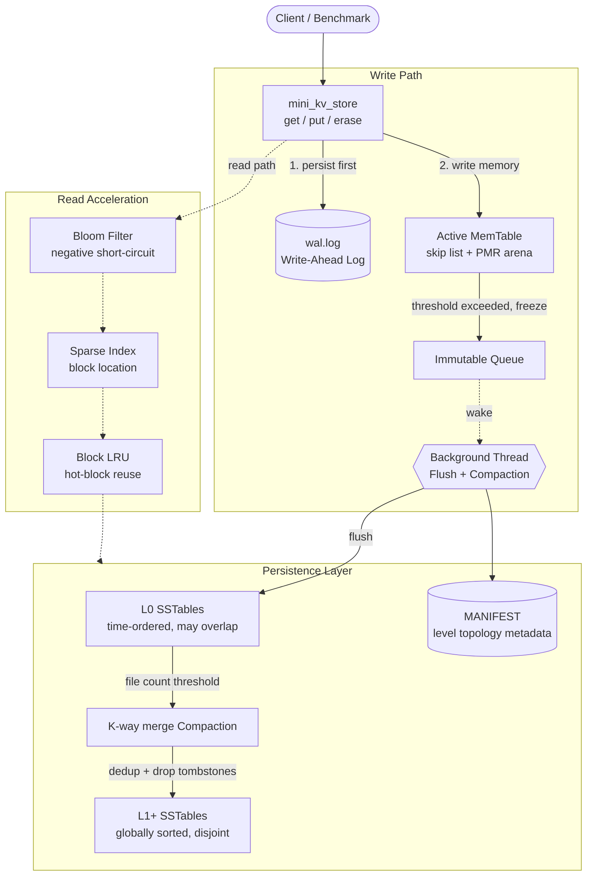

<div align="center">

**English | [中文](README.md)**

# Mini-LevelDB

**An LSM-Tree key-value storage engine built from scratch**

A complete, self-contained persistence stack in C++20: WAL, skip-list MemTable, SSTable, Bloom filters, sparse index, Block LRU cache, and multi-level Compaction — no third-party storage dependencies.

[](https://en.cppreference.com/w/cpp/20)
[](https://cmake.org/)
[](#)
[](#5-quality-assurance)
[](#6-quick-start)

</div>

---

## Table of Contents

- [1. What This Is](#1-what-this-is)
- [2. Highlights](#2-highlights)
- [3. Architecture](#3-architecture)
- [4. Core Design Decisions](#4-core-design-decisions-problem--challenge--solution--outcome)
- [5. Quality Assurance](#5-quality-assurance)
- [6. Quick Start](#6-quick-start)
- [7. Project Structure](#7-project-structure)
- [8. Known Boundaries & Roadmap](#8-known-boundaries--roadmap)

---

## 1. What This Is

`Mini-LevelDB` is a **teaching-grade but engineering-quality** embedded key-value storage engine. The goal is to re-implement the **LSM-Tree (Log-Structured Merge Tree)** architecture behind Google LevelDB / RocksDB in modern C++ — from the ground up, without calling into any storage library.

Every layer is hand-written: WAL durability, skip-list MemTable, SSTable binary format, Bloom filters, sparse index, Block LRU cache, and background multi-level Compaction.

It is useful if you want to:

- **Deeply understand how an LSM storage engine works** from the inside
- Study a **clean, self-contained reference implementation** that compiles standalone
- See **modern C++ features** (`std::pmr`, `std::span`, `std::bit_cast`, concepts) applied to real systems programming

> Writes follow "WAL first, then memory" for crash recoverability. Reads cascade through "MemTable → Immutable Queue → L0 → L1+" with Bloom filters + sparse index + block cache eliminating unnecessary disk I/O at each layer. This is the core skeleton of production KV engines.

---

## 2. Highlights

| Dimension | What was built |
|---|---|
| **Complete LSM pipeline** | WAL → MemTable → Immutable Queue → L0 SSTable → Compaction → L1+, fully self-implemented |
| **Modern C++ memory model** | Skip-list nodes allocated from `std::pmr::monotonic_buffer_resource` (arena), zero fragmentation, bulk reclaim |
| **Zero-copy binary codec** | `coding` module uses C++20 concepts + `std::bit_cast` / `std::span` for type-safe fixed-width serialization |
| **Three-tier read acceleration** | Bloom filter for negative short-circuit, sparse index for block location, Block LRU for hot-block reuse |
| **Read/write concurrency separation** | Foreground uses `shared_mutex`; background Flush/Compaction runs on a dedicated thread with condition-variable scheduling |
| **Engineering quality loop** | Valgrind zero-leak verification + native `perf` flamegraph profiling + ASan-located and fixed a real concurrency bug |

---

## 3. Architecture

### 3.1 Overview



### 3.2 Write Path

```
put(key, value)
   │
   ├─① append_to_wal()     — write + flush WAL first; crash-recoverable
   ├─② MemTable.insert()   — skip-list insert, O(log N)
   └─③ capacity probe      — if threshold exceeded: freeze current table into
                              Immutable Queue, background thread flushes async,
                              foreground returns immediately (no blocking)
```

### 3.3 Read Path (cascade, return on first hit)

```
get(key)
   │
   ├─① Active MemTable       — most recent data, shared_lock
   ├─② Immutable Queue       — reverse-order scan of tables being flushed
   ├─③ L0 SSTables           — reverse-time scan (files may overlap)
   └─④ L1+ SSTables          — upper_bound binary search for the one candidate file
            │
            ├─ Bloom Filter   — if definitely absent: short-circuit, zero disk I/O
            ├─ Sparse Index   — locate the data block offset for this key
            └─ Block LRU      — cache hit: return from memory; miss: read disk + fill
```

---

## 4. Core Design Decisions (Problem → Challenge → Solution → Outcome)

### 4.1 MemTable: PMR Arena + Skip List

**Problem**: The MemTable is the first landing point for writes — it needs ordered, high-frequency insertion and produces a large number of small objects (one node per key).

**Challenge**: Standard `new/delete` causes severe heap fragmentation and allocator overhead at high frequency; per-node deallocation at table destruction is also non-trivial.

**Solution**:
- Skip-list node payloads and forward-pointer arrays are both allocated from a `std::pmr::monotonic_buffer_resource` (1 MB initial arena).
- Node payload stores the encoded binary directly (`internal_key_size + key + seq/type pack + value_size + value`); the iterator exposes a **zero-copy** view via `std::span` (`ParsedRecordView`).
- Copy and move semantics are `= delete` to enforce clear ownership.

**Outcome**: The MemTable does append-only allocation throughout its lifetime; the entire arena is reclaimed in one shot on destruction. Valgrind confirms `allocs == frees` throughout — zero leaks.

### 4.2 Zero-Copy Binary Codec (`coding` module)

**Problem**: WAL, SSTable, and MANIFEST all need to reliably serialize scalars and variable-length strings to disk and read them back.

**Challenge**: Hand-written `reinterpret_cast` + pointer arithmetic is unsafe and error-prone on type/length mismatches.

**Solution**: C++20 concepts constrain the value type; serialization collapses into a small set of type-safe templates:

```cpp
template<typename T>
concept TrivialLayout = std::is_trivial_v<T> && std::is_standard_layout_v<T>;

template<TrivialLayout T>
constexpr std::array<std::byte, sizeof(T)> encode_fixed(T value) noexcept {
    return std::bit_cast<std::array<std::byte, sizeof(T)>>(value);  // compile-time, zero UB
}
```

**Outcome**: `encode_fixed / decode_fixed` perform layout conversion at compile time via `std::bit_cast` with no runtime copy. `write_raw / read_raw / write_slice` decouple physical I/O from object semantics and are reused across all persistence paths.

### 4.3 Three-Tier Read Acceleration: Bloom + Sparse Index + Block LRU

**Problem**: Read amplification is an inherent LSM pain point — a key may need to probe multiple SSTables before its existence can be confirmed.

**Challenge**: Every probe means a disk read; latency and I/O volume are unacceptable, especially for **non-existent keys**.

**Solution**: Three layers progressively narrow disk access:

| Layer | Mechanism | Effect |
|---|---|---|
| **Bloom filter** | One bitmap per SST, 3 FNV hash seeds | "Definitely absent" → short-circuit, **zero disk I/O** |
| **Sparse index** | One `<key, offset>` per ~4 KB block, `upper_bound` binary search | Narrows "scan whole file" to "read one block" |
| **Block LRU** | `(sst_id, offset)`-keyed `list + hash` LRU | Hot-block reuse, avoids repeated disk reads |

**Outcome**: Non-existent key queries are intercepted at the Bloom filter. Hit queries are bounded to a single data block by the sparse index. Repeatedly accessed hot blocks are served from memory by the LRU.

### 4.4 Background Flush and Leveled Compaction

**Problem**: A full MemTable must be flushed to disk; L0 file accumulation must be merged, otherwise read amplification grows unbounded.

**Challenge**: These are disk operations that take hundreds of milliseconds — running them on the foreground thread would freeze all reads and writes.

**Solution**:
- When the MemTable exceeds its threshold it is **frozen** into the Immutable Queue; the background thread is woken via condition variable; the foreground returns immediately.
- Compaction uses **K-way merge**: one streaming `sst_scanner` per L0 + L1 file, a min-heap (key ascending, same key → highest seq wins) drives the merge.
- During merge: **version deduplication** (only the latest version of each key survives) and **tombstone reclamation** (deletion markers are physically discarded), producing a globally sorted new SSTable.

**Outcome**: Foreground writes and background flushing are **fully decoupled**; the main thread is never blocked by disk I/O. Compaction is streaming — it does not load an entire level into memory.

### 4.5 Crash Recovery: Atomic MANIFEST Swap + WAL Replay

**Problem**: After a process crash or power loss, the engine must recover to a consistent state.

**Solution**:
- Metadata writes use the classic **write-to-temp → `std::filesystem::rename` atomic swap** pattern, preventing a half-written MANIFEST.
- On startup: `load_manifest_and_rebuild_cache()` reconstructs the level topology and Bloom/index caches, then `wal.log` is replayed to recover any MemTable data not yet flushed.

**Outcome**: The full "write → destruct → cold-start rebuild → read back" cycle passes in testing; data survives across process boundaries.

---

## 5. Quality Assurance

> The project goes beyond "it runs" — it establishes a complete quality loop: **memory safety → concurrency correctness → observable performance**. All results below were measured on WSL2 (Ubuntu, GCC 13, ext4).

### 5.1 Memory Safety: Valgrind Zero Leaks

Full `--leak-check=full` run on a mixed PUT / GET / DELETE workload:

```
in use at exit: 0 bytes in 0 blocks
total heap usage: 7,903 allocs, 7,903 frees, 44,696,689 bytes allocated
All heap blocks were freed -- no leaks are possible
ERROR SUMMARY: 0 errors from 0 contexts
```

The PMR arena's "append-only allocation, bulk reclaim" strategy keeps allocs and frees in perfect balance.

### 5.2 Concurrency Correctness: ASan-Located and Fixed a Real Bug

This is one of the most valuable engineering exercises in the project. The engine crashed intermittently under high load (`malloc(): unsorted double linked list corrupted`). AddressSanitizer reproduced it deterministically and pinpointed a **data race between the foreground write thread and the background Compaction thread on the shared `wal_file_` (`std::ofstream`)**:

```
==ERROR: AddressSanitizer: heap-use-after-free
  READ  of size 177  thread T0  ← foreground append_to_wal() → wal_file_.flush()
  freed by thread T1             ← background background_compaction_routine() → wal_file_.close()
```

The background thread freed the `ofstream`'s internal buffer during WAL truncation (`close()/open(trunc)`) while the foreground thread was still writing to the same object — a use-after-free that escalated into heap corruption.

**Fix**: Introduced a dedicated `wal_mutex_` for the WAL file handle, serializing foreground `append_to_wal`, background truncation, and destructor close (see [`CRASH_FIX_REPORT.md`](CRASH_FIX_REPORT.md)).

**Outcome**: Before fix: crash at ~20,000 ops. After fix: 40,000 ops (including deletes) completes stably; ASan re-run reports zero errors.

### 5.3 Performance Profiling: Native perf Flamegraph

Generated using the standard pipeline: `perf record -F 299 -g --call-graph fp` → `perf script` → FlameGraph (full workflow in [`LEAK_AND_PERF_WORKFLOW.md`](LEAK_AND_PERF_WORKFLOW.md)).

[](docs/flamegraph.svg)
<sub>Click for interactive SVG</sub>

CPU hotspot distribution by sample weight:

| Hot path | Sample share | Interpretation |
|---|---|---|
| `compact_level0_to_level1()` | **~84%** | Compaction dominates — consistent with LSM write-amplification design |
| `llseek` (`tellg` / `tellp`) | ~33% | **Per-record `tellp()` calls** during merge trigger a flood of `lseek` syscalls |
| Write I/O (`ostream::write` etc.) | ~23% | Sequential SSTable writes |
| `append_to_wal` / `flush_imm_to_sstable` | ~5% each | Foreground flush paths — healthy share |

> **Actionable optimization finding**: The flamegraph clearly exposes that calling `tellp()` once per record during Compaction is the real bottleneck — `lseek` accounts for roughly one-third of all samples. Replacing it with a **running offset accumulator** would eliminate the vast majority of those syscalls. This is exactly the value of profiling: bottlenecks are measured, not guessed.

### 5.4 Engine Benchmark (Throughput / Latency)

Post-fix engine, single-threaded, 8,000 ops, 1,000 keys, 64-byte values (latency in µs):

| Scenario | Read/Write/Delete | Throughput (ops/s) | PUT P50/P99 | GET P50/P99 |
|---|---|---|---|---|
| write_heavy | 10/90/0 | ~354,000 | 0 / 5 | 2 / 62 |
| read_heavy | 90/10/0 | ~298,000 | 0 / 154 | 1 / 33 |
| mixed | 60/30/10 | ~206,000 | 0 / 149 | 1 / 58 |
| mixed_with_delete | 50/30/20 | ~259,000 | 0 / 112 | 1 / 51 |

> Note: "fail" counts in mixed scenarios come from GET returning empty for already-deleted keys — **expected behavior**, not errors. Absolute throughput is influenced by WSL2 filesystem semantics; these numbers are primarily useful for **comparing relative behavior and tail latency across workload shapes**, not as cross-environment baselines.

---

## 6. Quick Start

### Requirements

- C++20 compiler (GCC 13+ / Clang 16+)
- CMake 3.28+
- Linux or WSL2 (requires `epoll` and other POSIX interfaces)

### Build and Run

```bash
# Configure + build
cmake -S . -B build
cmake --build build

# Run the current entry point (network echo service, port 8080)
./build/Mini_LevelDB
```

### Using the Storage Engine Directly

The engine compiles standalone with a minimal API:

```cpp
#include "db/includes/mini_kv_store.h"

mini_kv_store kv;
kv.put("hello", "world");          // write
std::string v = kv.get("hello");   // read → "world"
kv.erase("hello");                 // delete (writes a tombstone)
// destructor automatically joins the background thread and flushes WAL
```

> The current CMake default target is `main.cpp` (network layer). To reproduce the benchmarks and profiling in Section 5, see the engine-specific build commands in [`LEAK_AND_PERF_WORKFLOW.md`](LEAK_AND_PERF_WORKFLOW.md).

---

## 7. Project Structure

```
Mini-LevelDB/
├── db/
│   ├── mini_kv_store.cpp          # Engine core: read/write paths, Flush, Compaction, caches
│   └── includes/
│       ├── mini_kv_store.h        # Engine facade and internal structure definitions
│       ├── db_format.h            # Record / search types (ParsedRecord, SearchResult)
│       └── coding.h               # Zero-copy binary codec (concepts + bit_cast)
├── mem_table/
│   ├── mem_table.cpp              # Skip-list MemTable implementation
│   └── includes/mem_table.h       # PMR arena + skip-list nodes + zero-copy iterator
├── server/
│   └── includes/wire_protocol.h   # Binary network protocol with 10-byte fixed header
├── main.cpp                       # Current CMake entry: epoll network echo service
├── CRASH_FIX_REPORT.md            # Full concurrency bug investigation and fix
├── LEAK_AND_PERF_WORKFLOW.md      # Leak detection + native perf flamegraph workflow
└── docs/
    ├── flamegraph.svg             # Interactive CPU hotspot flamegraph
    └── flamegraph.png             # Static PNG version
```

---

## 8. Known Boundaries & Roadmap

Honest accounting of current limitations — these are visible next steps, not hidden defects:

| Area | Current state | Next step |
|---|---|---|
| **Compaction offset overhead** | Per-record `tellp()` during merge; `lseek` accounts for ~33% of samples | Replace with a running offset accumulator (flamegraph-identified) |
| **Compaction strategy** | L0→L1 full merge (MVP) | Key-range-based partial Compaction; multi-level L1+ cascading |
| **Network integration** | `main.cpp` is still a standalone echo service | Wire `wire_protocol` to the engine for a complete KV server |
| **Write throughput** | Write path serialized by a single exclusive lock | Group commit to reduce WAL flush frequency |
| **Test infrastructure** | Benchmark programs + Sanitizer validation | GoogleTest + CTest regression suite |

---

<div align="center">

**Mini-LevelDB** · A complete LSM-Tree storage engine in modern C++

If this project helped you understand how storage engines work, a Star ⭐ is appreciated.

</div>
